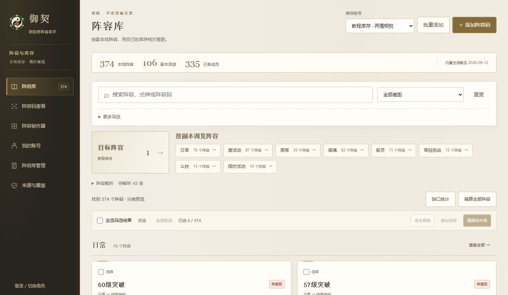
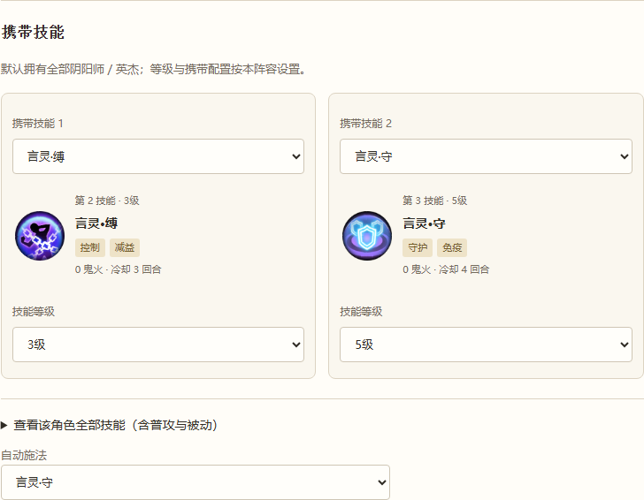

# 御契 · 阴阳师阵容助手

Windows 上的本地阵容管理工具：按副本找阵容，导入自己的式神与御魂库存，核对配置差距，也能制作阵容并生成二维码或官方短码。

**Windows x64 · v0.9.4 公开测试版 · 无需另装 Node.js 或 Python**

提供安装版、免安装版和 **32 页 PDF 图文教程**。当前版本沿用 v0.9.3 教程，含 26 张界面截图、操作标注与可点击目录。升级前请先导出备份；免安装版需完整解压后运行。

[下载安装包](https://github.com/tORHANSxd/onmyoji-lineup-atlas/releases/download/v0.9.4/Yuqi-Setup-0.9.4-Windows-x64.exe) · [下载免安装版](https://github.com/tORHANSxd/onmyoji-lineup-atlas/releases/download/v0.9.4/Yuqi-Portable-0.9.4-Windows-x64.zip) · [PDF 图文教程（v0.9.3）](https://github.com/tORHANSxd/onmyoji-lineup-atlas/releases/download/v0.9.4/Yuqi-Guide-0.9.3.pdf) · [当前版本说明](https://github.com/tORHANSxd/onmyoji-lineup-atlas/releases/tag/v0.9.4)

## 主要功能

- **按副本找阵容**：内置 373 条有原码的记录，支持逐级分类、首领、层数和魂土 / 真蛇等别名搜索。
- **核对账号差距**：分别显示「式神缺少」「御魂不达标」「式神技能或等级或觉醒不达标」，同一阵容可同时显示多个标签。
- **目标与批量精算**：勾选阵容存入当前库存账号的「目标阵容」，支持跨页全选、反选及勾选精算；打开「缺口统计」会计算当前筛选结果，按受影响阵容数汇总缺少的式神与御魂。
- **查看完整要求**：成员、技能、御魂套装、位置和面板集中展示；阴阳师、契灵和术印保留显示，不参与达标检查。
- **制作自己的阵容**：首位固定阴阳师／英杰，后续式神按副本人数配置；支持技能等级、智能或锁定施法、御魂要求、原生配速及契灵术印。
- **管理自己的阵容库**：支持单条和批量添加、复选、全选、重新解析与删除，包括内置预设；两个列表均有多种排序，适用副本可手动多选。
- **本地使用与备份**：已有内容可离线查看，支持多库存账号、导出备份和恢复；手机授权后可保存查询登录。





以上截图来自实际软件页面，使用合成账号与演示阵容，不含真实登录凭据，也不作实战阵容推荐。

## 开始使用

1. **下载安装**：运行安装包并按向导操作；或将免安装 ZIP **完整解压**，运行其中的 `御契.exe`。不要只复制单个 EXE。GitHub 的 `Source code` 是源码，普通使用者不必下载。
2. **先浏览阵容**：启动后直接进入阵容库，按分类逐级进入，或展开「更多筛选」搜索具体副本；没有结果时可点「清空筛选，查看全部」。
3. **需要查询文字短码时登录**：进入「登录 / 切换角色」，先阅读醒目的免责声明，并勾选确认使用可弃用的小号、自行承担账号风险，再用阴阳师手游扫码。软件默认选中等级最低的可用角色，也可在「服务器与角色」中切换；无角色时请先在游戏中创建，再点「刷新角色列表」。手机允许保存后可免扫码续用；每次启动仍需先确认风险，再点「登录此账号」。
4. **导入自己的库存**：进入「我的账号」，导入平安志 `mumu-snapshot-v1` JSON，在右上角选择要核对的账号。首次或更新完整库存时，通常不勾选「增量合并旧库存」。在「其他采集数据与范围」中可查看新版快照的资源、堆叠素材、碎片、结界卡和任务等记录数量，以及未采集的项目。增量合并会保留未重新采集的扩展记录并标明旧快照时间；完整替换以新文件为准。
5. **精算与查看差距**：导入库存后不会自动精算全部阵容。勾选需要的阵容后精算，或点击「精算全部阵容」；可加入「目标阵容」方便下次查看。「缺口统计」会自动精算当前筛选结果，支持暂停、继续。进入详情核对配置，再按下方说明选择游戏导入方式。
6. **定期备份**：通过「阵容库管理」整理记录；升级、大批删除或换电脑前，点击左下角「导出备份」。恢复时先核对账号、阵容数量和重复项保留版本，再确认恢复；本机独有阵容会保留，库存账号采用备份内容。成功后页面顶部提供撤销入口，继续修改资料后不能直接撤销。

**扫码登录用于查询阵容码和主动生成官方短码，库存需要另行导入，两者可以使用不同账号。** 御契不负责从游戏导出库存；没有平安志 JSON 时仍可浏览、管理阵容。批量添加支持逐行原码、TXT / TSV，或从 Excel 复制「阵容码、名称、副本／用途、备注」四列，不直接读取 XLSX。

### 阵容制作与游戏导入

进入「阵容制作器」，先选择游戏原码副本，再填写成员、技能、御魂与契灵要求。阴阳师／英杰固定在首位，式神可拖动或上下移动；「按顺序配速」采用高于后续成员的游戏原生规则。可先保存草稿，配置完整后保存到阵容库并生成预览。

| 内容 | 获取方式 | 使用入口 |
| --- | --- | --- |
| 完整数据 `#TA#…` | 制作器「复制完整数据」，可离线生成 | 本软件解析或留存；游戏使用承载这份数据的二维码 |
| 阵容二维码 | 制作器「导出二维码图片」，可离线生成 | 游戏阵容助手的二维码入口；本软件也可读取二维码图片 |
| 官方短码 `\|TA\|…` | 登录已有且可查询的角色后，主动「生成官方短码」 | 游戏阵容助手的文字导入入口 |

**不要把 `#TA#` 完整数据粘贴到游戏的文字短码入口。** 完整码本身不能反推出原来的官方短码；修改阵容后需重新生成，已分享的旧短码不会自动更新。旧版缺少合法副本而生成的错误二维码／短码，需要在新版选好原码副本后重新生成。

手动适用副本在「阵容库管理 → 编辑」中多选，优先于原码、来源与预设分类，重新解析也会保留。「扩展副本」仅供软件分类，导出时仍须使用游戏支持的原码副本。

### 备份、恢复与复位

- **导出备份**：包含去重后的阵容及原始解析数据、预设修改和删除状态、库存账号与原始库存、当前账号、目标选择和已保存草稿；不包含登录凭据、程序文件及运行缓存。导出本身不改动当前资料。
- **恢复备份**：先预览，再合并。本机独有阵容会保留；本机、备份与内置预设中，同名、同码或同 ID 的重复组保留最新有效时间的记录。时间相同依次优先本机、备份、预设，备份导出时间不参与比较。库存账号、当前账号和草稿采用备份内容；保留下来的账号合并双方目标选择。成功后本次运行可撤销一次，继续修改资料后不能直接撤销。
- **复位阵容库**：展示影响数量，倒计时 **5 秒** 后才能确认。恢复全部内置预设，清除所有自建／导入阵容、预设修改、目标选择和草稿；保留库存账号与登录凭据。需要保留个人阵容时，先导出备份。

### 图文教程

[下载 32 页 PDF 图文教程（v0.9.3）](https://github.com/tORHANSxd/onmyoji-lineup-atlas/releases/download/v0.9.4/Yuqi-Guide-0.9.3.pdf)，可离线阅读，支持目录跳转与页面书签。

| 想完成的操作 | 教程页码 |
| --- | --- |
| 下载、安装、查找阵容与查看详情 | 3–6 |
| 导入库存、设置目标、精算与缺口统计 | 7–12 |
| 解析阵容码、扫码、选择角色与保存登录 | 13–16 |
| 制作阵容、技能与契灵、御魂配速和导出 | 17–24 |
| 批量管理、副本分类、备份、复位与资料更新 | 25–30 |
| 故障处理与验证范围 | 31–32 |

## 必要说明

- **登录风险与免责声明**：必须使用不再使用、无重要资产、能承受封禁损失的小号，禁止使用主号。查询账号用于解析阵容码与用户主动生成分享短码；凭据仅在本机按授权加密保存，不上传开发者或其他第三方服务器，认证与解析请求仍需发送网易官方服务。如因使用本软件导致封号、冻结或其他账号损失，由使用者自行承担风险；在法律允许范围内，本软件及开发者不承担由此产生的责任。新版在扫码和已保存账号续用之前均要求主动确认；不接受时可继续离线使用。

- **覆盖安装问题**：部分环境下的 `pwsh.exe / Unknown Hard Error` 尚未解决。遇到后停止覆盖并保留备份，可改用完整免安装版。当前完成了包内容和解包程序运行验证，未完成实际安装、覆盖及卸载验收。
- **角色与查询权限**：未确认适用于所有服务器的统一最低角色等级。软件会尝试初始化角色的阵容助手；若仍不能查询，可先用该角色在游戏中打开一次阵容助手，再回软件重试。没有可用角色时，应先在游戏创建角色。
- **计算与库存**：培养式神、强化或消耗御魂后，请重新导出完整 JSON 并替换导入。上下限均为硬约束；「计算中」与资料不足的「待核对」不表示无解。已核对游戏属性与六条式神专用公式，但未完整复刻游戏原生配装内核，不能保证结果完全一致，也不保证通关。
- **数据在本机**：用户资料位于 `%APPDATA%/onmyoji-lineup-atlas/`。安装包和免安装版不内置已登录账号；保存凭据按当前 Windows 用户加密，不进入备份，换电脑需重新扫码。
- **两种 JSON 分开使用**：平安志文件用「我的账号 → 导入」更新库存；御契备份用「恢复备份」。备份包含个人库存，请自己保管。
- **版本与来源**：非网易官方工具，当前未数字签名。资料快照截至 2026-09-12，原码有效性以查询结果为准。游戏素材权利见 [第三方说明](THIRD_PARTY_NOTICES.md)。

各版本更新内容仅记录在 [Release 页面](https://github.com/tORHANSxd/onmyoji-lineup-atlas/releases)。

Release 附有 [SHA256SUMS.txt](https://github.com/tORHANSxd/onmyoji-lineup-atlas/releases/download/v0.9.4/SHA256SUMS.txt)，可核对安装包和免安装版；随附 PDF 的校验值一同提供。指南截图使用演示数据，不含真实账号或登录凭据。

## 开发

```powershell
npm ci
npm run build:login
npm test
npm start
# 构建 Windows 安装包
npm run dist
```

开发需要 Node.js、Python 和 Windows 构建工具。以上命令在项目根目录运行，构建命令不自动发布 Release。

当前版本的导入、计算、备份和界面验证见 [验收记录](verification/RESULTS-v0.9.4.md)。真实库存验证只提交不含身份与实例 ID 的统计结果；回归测试使用合成数据。

正式登录模块已取得 158 个服务器与登录二维码，**未进行手机扫码**。首次角色自动初始化、全部官服／渠道服／iOS／安卓授权组合，以及当前游戏内的实际导入仍需实机补验；登录与角色选择的其他回归使用协议和合成状态。静态规则、合成状态和本机编解码通过，不等同于实机验证通过。

可复现检查（在项目根目录运行）：

```powershell
# Python 测试使用构建登录模块时创建的环境，采集器边界测试另需 Pillow
& '.\user-data\ta-build-venv\Scripts\python.exe' -m pip install Pillow
& '.\user-data\ta-build-venv\Scripts\python.exe' -X utf8 -m unittest discover -s tests -p 'test_*.py'
# 异常兜底、并发保存与响应式界面；使用隔离的合成数据
& '.\node_modules\electron\dist\electron.exe' tools/verify-optimization-ui.cjs --visual | Out-String
& '.\node_modules\electron\dist\electron.exe' tools/verify-revision-ui.cjs | Out-String
& '.\node_modules\electron\dist\electron.exe' tools/verify-creator-ui.cjs | Out-String
# 与运行时 HEAD 中的求解器对照，不读取个人库存
node tools/benchmark-exact.cjs --synthetic
```

[热点性能对照](verification/performance-hotspots-v092.json)与[桌面压力测试](verification/performance-ui-v093.json)记录对应版本的测量方法及结果；使用合成库存，不代表所有阵容或真实网络的耗时。

[御魂计算口径](docs/SOUL_CALCULATOR.md) · [阵容码协议](docs/TA_PROTOCOL.md) · [登录与解析验证](docs/LOGIN_AND_PARSER_V073.md) · [MIT 许可证](LICENSE)
