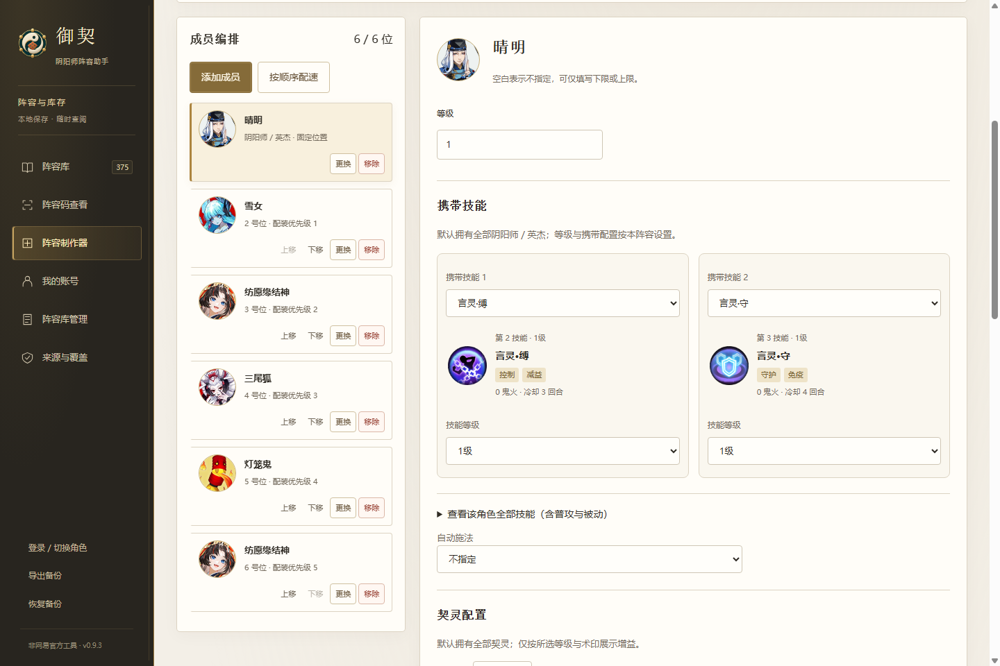
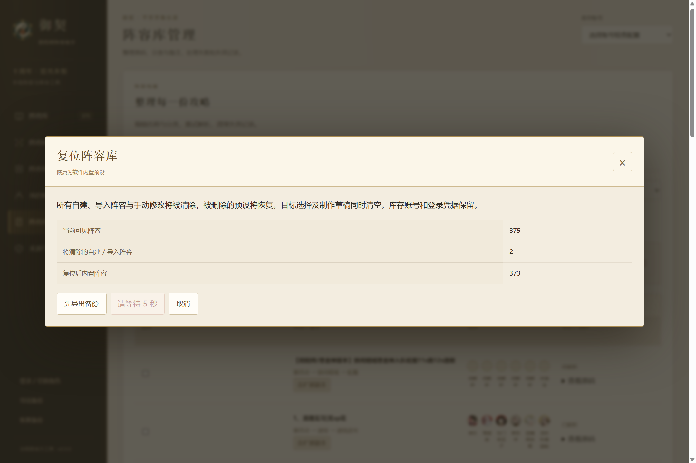
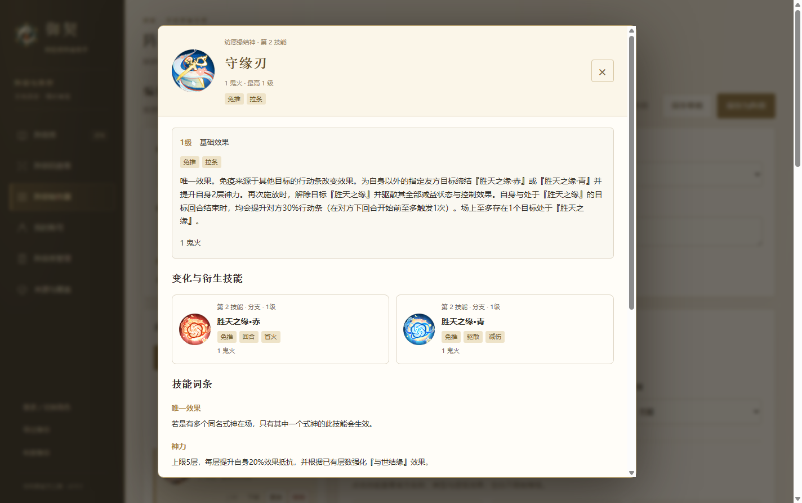

# 0.9.3 官方配置、制作器与阵容库管理

本版沿用周年活动的墨褐、象牙白与金色风格，移除活动海报与宣传装饰。保留阵容制作器、手动多副本、管理批量操作和复位。安装包与免安装版在本地 release 目录交付，未发布 GitHub Release。

## 0.9.1 备份恢复规则

导出备份包含库存账号及原始导入数据、当前账号选择、去重后的阵容（含内置预设）、预设删除记录、已合并的阵容 ID、各账号的目标阵容和制作器草稿。登录凭据与官方资源缓存不在备份中。导出只整理文件内容，不修改当前阵容库。

恢复时合并本机、备份和内置预设，保留本机独有阵容。名称、阵容码或 ID 任一相同，就作为重复记录处理；相互串联的重复记录也归入同一组，只保留时间最新的一条完整记录。名称忽略首尾空白；阵容码按现有规则规范化，完整码及对应裸内容等价，已关联的官方短码也参与比较。历史合并 ID 会继续参与识别，保证分别编辑过的旧版本仍能正确合并。

记录时间取 `updatedAt`、`parsedAt`、`createdAt`、`date` 中最新的有效日期。失败查询的时间、备份导出时间和本次恢复时间不参与比较。全部时间缺失或无效时排在最后；时间相同优先本机，其次备份，再次内置预设。同一来源仍相同时保留靠后的记录。正常编辑保存与成功解析会记录各自的时间。

恢复预览显示前后数量、合并组数，以及每组保留版本的来源与时间。当前 373 条原始预设在没有用户修改时会按同名规则整理为 318 条；原始预设没有从软件中删除，阵容库复位仍恢复全部 373 条。已合并的预设不会在重启后再次出现；后续预设版本在下一次合并时仍参与时间比较。明确删除的预设不会仅因加载原始预设而重现。

库存账号、当前账号和制作器草稿沿用备份内容。对于恢复后仍存在的账号，合并双方目标阵容选择，并将被合并的旧 ID 指向保留版本；草稿的已保存阵容引用同步调整。保存失败不覆盖原资料，成功恢复后可以撤销一次；恢复后继续修改资料则不能直接撤销。复位会清除阵容合并记录、自建与导入内容，库存账号和登录凭据仍保留。

## 使用流程

1. 先选择游戏副本；首位固定阴阳师／英杰，其余为该副本要求的五个或六个式神位置。式神可拖动或点击上移、下移；同名式神可重复添加。阴阳师配置携带技能与契灵，式神配置培养、御魂套装、二四六号位主属性和面板范围。空白表示不限，范围可只填一端。
2. 「按顺序配速」采用游戏原生最高属性规则。任意差值／倍率增强关系已移除，不再参与计算；旧备份中的历史字段不会为此被破坏。技能卡显示名字、第几技能、真实图标、官方类型词条和鬼火消耗，点击查看全部等级与变化分支；自动施法可不指定、智能或锁定可用技能。
3. 保存草稿可稍后继续；保存为阵容后，可按游戏原生要求进行软件内精算。复制已有阵容到制作器会新建一份，不直接改写原记录。再次保存同一自建阵容，会保留管理页手动指定的副本。
4. 生成预览后可复制完整码或导出 PNG 二维码。游戏文字入口使用服务器生成的 |TA| 短码，#TA# 完整码供二维码扫描。内容超过二维码容量时仍保留完整码，提示缩短说明或生成官方短码。
5. 生成官方短码需要用户主动点击、登录已有角色。收到服务器返回后，软件比对原生成员、要求、名称、说明及副本；不一致时拒绝关联。

## 阵容库

管理页支持复选、反选和跨分页全选，选择范围是当前筛选结果。改变筛选会清空选择；换页和排序会保留。选中项可以批量重新解析或删除。阵容库和管理页均支持名称、用途、修改时间、添加时间、解析时间、解析状态、来源、成员数和资料原有顺序排序；阵容库另保留差距排序。

副本分类优先级：手动多副本 > 旧版手动分类 > 本版逐条整理 > 原码和既有自动规则。手动分类随重解析、更新和备份保留。「扩展副本」表示游戏原码列表中没有的副本或细分用途，可筛选、可归类，不编造游戏副本 ID。

373 条内置记录都有用途核对记录，67 条路径与原分类不同，整理出 72 种扩展用途。明确保留神龙排除、普通/极难度、2 倍血量、精英/副将/首领、区域和层数限制，不能把这些阵容扩大成全副本通用。328 条同时有原码配置，45 条尚缺完整解析；福利寮的一条用途证据不足，标为待核对。用途整理不代表已经逐条完成游戏实战验证。

「复位阵容库」展示影响数量，可先导出备份。真实等待 5 秒后才能确认；确认会删除全部自建和导入阵容、撤销预设修改/删除、清空目标选择和制作草稿，恢复所有内置预设。保留库存账号和登录凭据。等待期间数据变化则重新预览、重新倒计时；保存失败保留原库。复位、恢复备份和撤销恢复会取消旧导入结果，迟到的查询不能将阵容重新写回。

## 原码与公开样本

完整码使用整数键 MessagePack → zlib → Base64，加 #TA# 前缀。输出 V3，字段顺序、套装 ID 偏移、八类属性、技能偏移和最高属性顺序均按本机静态 TAPacker 核对。范围的 -1 表示该端不限；use_score 是数值，可以是小数，不能当作布尔值。导出不冒填 player_id、hostnum、huids。

V0–V3 的十二份既有协议向量都做重新编码对照；V0 空配置在桌面使用已收录的六位阴阳师 ID 判定。阴阳师、契灵与术印仍仅保留展示，不参与御魂精算。

[清流不加班公开攻略](https://www.taptap.cn/moment/847990995868976163?group_id=71) 的 1080×3356 原图识别到三套阵容，成员数为 7、7、6。来源、图片摘要和完整码摘要见 tests/fixtures/public-qr-samples.json。原图未放入软件安装包。长图识别采用整体与重叠分段扫描，结果去重，支持多码选择和取消。

长码没有 share_key，无法凭本地解码反推出原短码。只有本机已有官方查询返回且完整内容吻合，或者官方分享回包通过内容比对时，才显示关联短码。文章里的短码排列顺序不作为映射证据。官方分享方法为 lineup_assisant_logic.save_and_share_lineup_data，参数 lineup_data 不带 #TA#；只接受当前角色实体的对应回调，不自动重试分享写入。若官方已生成短码但缓存写入失败，仍显示短码并提醒复制留存；不会因为本地故障再次创建分享。

## 登录检查与待实机验证

先查询已授权账号的角色，再筛选渠道兼容且有连接地址的服务器，默认选择等级最低的角色；未知等级排后。角色查询失败、确实没有角色和服务器不兼容分别提示。读取不到角色时不会假装成功。

静态来源：

- 用户提供的 MuMu 解包快照：研究资料/mumu-onmyoji-extractor/exports/onmyoji/20260912_211558_280259。
- 已提取的 TAPacker、TAConst、ClientEntities、ServerManager、UserInfoMgr 与 Android SDK：研究资料/d-download-onmyoji-netease-116-2/work。
- 桌面客户端：E:/Program Files/yys/bin。只读程序文件，没有读取官方客户端账号数据库或提取登录凭据。

渠道会话按已核实的 Android SDK 路径转换：非 netease/external_netease 的 token 先 URLDecode，再 Base64Decode，作为不透明 SESSION 字符串；原 MPay token 保持独立。SAUTH_JSON 的 14 个保留键仍排除，额外签名字段保留，授权字符串正确转义。PC account_info 只按静态证据覆盖非空 login_channel、sessionid、sdk_version、cpid。iOS 保留 app_store 渠道，未知 PC 来源不擅自默认为安卓。

渠道 FULL_UID 只接受官方授权中明确的 full_uid 或 UNISDK_LOGIN_JSON.username，不能用角色查询 UID、任意解码字符串或猜测公式补齐。缺少该信息时给出适配提示。现有资料不能证明所有渠道均返回这项映射，因此不能宣称全渠道已成功登录。渠道账号目前使用临时会话；网易账号仍只在手机明确授权并满足既有条件时使用 Windows safeStorage 加密记住，未授权或加密失败则不落盘。

本轮没有手机扫码，以下需要后续补验：官服安卓、官服 iOS、哔哩哔哩及其他渠道服的实际授权字段与角色进入；无角色账号提示；允许/不允许记住和重新启动续登；官方分享短码回包；长码/二维码在真实游戏内导入。失效、被删除、被拒绝以及未来版本的原码无法保证解析，必须展示具体原因。

## 0.9.1 备份合并验收

226 项 Node 测试、37 项通用界面检查和 20 项制作器检查通过。新增覆盖同名/同码/同 ID、预设冲突、历史 ID 分叉、无效时间、重复恢复、目标和草稿引用、失败回滚、保存并发与重启后的结果。

1,172 项包内一致性检查通过；安装包与免安装版分别核对全部 208 个文件，安装包在独立目录启动通过，现有安装未改动。实际安装、覆盖和卸载仍未执行。详见 [0.9.1 验收记录](../verification/backup-merge-v091.json) 与 [交付文件 SHA256](../release/SHA256SUMS-0.9.1.txt)。

## 0.9.0 验收记录

218 项 Node 测试、52 项 Python 测试、制作器 20 项页面检查和通用界面 33 项检查通过；综合页面回归覆盖 20 种页面尺寸组合。失败注入使用合成磁盘故障，原资料与草稿均保留。

安装包解包后 208 个文件与构建目录逐项一致，独立目录启动通过；正式登录模块能读取 158 个服务器并取得二维码，但没有手机扫码。免安装 ZIP 的 208 个文件也通过 CRC 与 SHA256 核对。包内源码、资源、运行时和协议共 1,172 项匹配检查通过，没有混入库存样本、用户数据库或保存凭据。现有安装与个人资料未改动；实际安装、覆盖和卸载尚未验收。

详细记录见 [本地验收汇总](../verification/optimization-v090.json)，交付文件校验值见 [SHA256](../release/SHA256SUMS-0.9.0.txt)。

## 0.9.2 修复与验证边界

用户提供的 PNG 二维码与完整 #TA# 数据完全一致。解码结果没有 select_stage_id，也没有旧版副本回退字段。客户端 TAHelper.check_team_info_valid 会检查成员、御魂以及原生副本 ID；缺少副本时即返回「阵容码设置有误，暂不支持导入」。只验证编解码自洽不足以证明游戏可导入。用户样本已作为 tests/fixtures/ta-missing-stage.png 回归夹具。

制作器导出和分享要求选择已收录的游戏原生副本，并检查成员与御魂 ID。手动多副本分类仍优先，扩展副本仅用于软件内分类，不会伪造成游戏副本。草稿允许暂不选副本。#TA# 数据供二维码扫描；游戏文字输入面板只接受 |TA|。旧二维码和旧短码不会自动改变，需重新生成。

解包依据为研究资料/d-download-onmyoji-netease-116-2/work：5372.marshal 的 TAHelper.is_ta_open 调用 helpers.isSystemOpen；5424.marshal 的 SYSTEM_ID 为字符串 988；21638.marshal 从角色 function_switch 读取状态；4677.marshal 的 TeamAssistView.initDefault 调用 get_info；26351.marshal 定义初始化与分享查询 RPC。软件现在在每次新角色连接中完成 get_info 回包确认后才查询/分享，功能未开放或初始化超时会暂停批次。这些客户端函数未显示统一的最低等级，不能据此编造等级门槛，也不能证明服务端不存在其他条件。

架构继续使用 Electron：桌面主线程处理窗口、权限与提交边界；Node Worker 处理编码、二维码生成、缓存 JSON 以及状态序列化；页面 Worker 处理大 JSON 与图片解码。大资料通过文本跨越 contextBridge，避免逐字段复制；连续解析仅提交变更阵容。保存先写临时文件，再核对原登录角色并提交；提交成功后即使登录变化也确认实际写入，页面与磁盘保持一致。

分类、预设合并和库存检查复用不可变记录索引。更换库存、更新资料或替换阵容对象后重新计算。库存检查每片约 8 毫秒；批量界面更新合并至约 120 毫秒；搜索合并至 100 毫秒。目录预览每组最多 3 条，完整列表分页；失败清单展开后每次最多显示 40 条。

相同 VM 加载方式下，五次中位数对照 0.9.1：3000 条阵容修改一条后的分类与合并约 1005.49 → 1.47 毫秒；完整 32.93 MiB 快照的连续传输改为约 12 KiB 单条增量。该数字只反映所测处理步骤，不是所有操作的总耗时。真实 Electron 压力测试和详细方法见 verification/performance-hotspots-v092.json、verification/performance-ui-v092.json。测试使用公开阵容及合成库存，不读取私人账号。

待实际扫码验收：从未进入阵容助手的角色、功能未开放的低等级角色、不同渠道/iOS/安卓账号，以及新生成二维码和官方短码在游戏中的导入。当前已完成静态协议比对、本机编解码和合成回包测试，未声称这些实机项目已通过。

## 0.9.2 本地交付验收

235 项 Node 测试、54 项 Python 测试、37 项通用界面检查和 20 项制作器检查通过；综合页面回归覆盖 20 种页面尺寸组合。3000 条阵容、5000 个式神的合成压力测试连续解析并增量保存 20 条，期间成功切页 57 次，界面计时器最大间隔约 54 毫秒、95 分位数为 11 毫秒。长图识别在后台进行，取消后不会将迟到结果填入当前输入。

1,176 项包内源码、素材、运行时及协议一致性检查通过。安装包与便携版分别核对全部 208 个文件；安装包解出的程序在独立目录启动通过，正式登录模块取得 158 个服务器及登录二维码。未进行手机授权，未实际安装、覆盖或卸载，现有安装与个人数据保持不变。

交付文件为 release/Yuqi-Setup-0.9.2-Windows-x64.exe 和 release/Yuqi-Portable-0.9.2-Windows-x64.zip。详见 [验收汇总](../verification/optimization-v092.json) 与 [SHA256 校验值](../release/SHA256SUMS-0.9.2.txt)。

## 0.9.3 客户端资料与兼容规则

通过 tools/extract-game-catalog.py 静态读取当前 THX 映射的客户端数据，优先补丁资源；没有执行游戏脚本。使用 hero、skill、skill_tree、skill_tag、skill_tips、hunling_base、hunling_attr、hunling_mark、hunling_mark_group、team_assist_stage 等表，解析继承与占位说明，并按 UiUtil._formatDesc 的绝对值／百分比规则格式化。data/game-config.json 为每个数据源和转换后图标记录摘要。

覆盖 286 个角色、1,036 个技能、4,954 条等级记录、53 条技能类型词条、8 个契灵、48 个术印及 1,026 张真实技能图标；提取报告没有缺名、缺图、未解析占位字段。这里的“覆盖”指本机 2026-09-12 客户端快照，不代表后续游戏更新。衍生技能、觉醒版本与词条可在详情查看。

TAHelper.get_hero_ori_skill_list_by_tmp_hero_data 会对式神技能 ID 排序，因此铁鼠等角色的第三技能不能按表中原始排列当作第二技能。八百比丘尼占卜之印和泷夜叉姬月之奥义采用各自的自动技能映射。被动判断按 skillOwnerType／skillType，不能把 skillKind 当作是否被动。

默认拥有全部阴阳师／英杰和契灵，等级与技能按阵容设置；不虚构平安志未导出的库存属性。契灵属性采用 base + growth × 等级，术印重复次数表示等级。新编辑提供两个术印配置位；从历史码读入的其他术印、0 级和所属组保留，修改术印时才重新配置。328 条内置真实解析结果全部通过规则检查。

导入／分享已有原码按 TAHelper.check_team_info_valid 核查副本、成员和御魂；制作器另外检查固定首位、完整人数、技能归属与等级。两种校验分开，避免用新建界面的限制拒绝合法历史内容。

再次核对 TeamAssistView.initDefault → lineup_assisant_logic.get_info → get_info_cb.info 的初始化链路。当前软件每次新建角色连接都会先完成该流程，再查询或分享；function_switch 的 988 项明确关闭时停止。未发现额外授予权限 RPC。初始化失败时保留已解析阵容并暂停批量；“从未进入过游戏助手”的角色能否由此解锁仍需实机扫码确认。

244 项 Node 测试、55 项 Python 测试、37 项通用界面检查和 23 项制作器检查通过，另完成综合页面回归。2,952 张本地图片通过摘要、解码和尺寸校验；不将此称为逐张人工视觉核对。大库压力测试用 3,000 条阵容、5,000 个合成式神连续解析保存 20 条，计时器最大间隔约 52.3 毫秒；不代表真实网络延迟。
